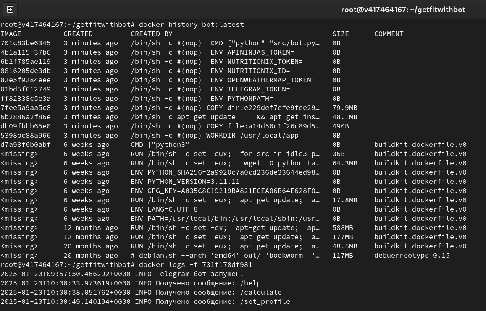

# GetFit with Bot (@getfitwithbot)!
A Telegram bot for tracking calories, water, workouts.

Link: **@getfitwithbot**

# Screencast


# Deploy
1. Create .env file like the one below:
```
PYTHONPATH = <YOUR PYTHONPATH>
TELEGRAM_TOKEN = <YOUR TELEGRAM TOKEN>
OPENWEATHERMAP_TOKEN = <YOUR OPENWEATHERMAP TOKEN>
NUTRITIONIX_ID = <YOUR NUTRITIONIX ID>
NUTRITIONIX_TOKEN = <YOUR NUTRITIONIX TOKEN>
APININJAS_TOKEN = <YOUR APININJAS TOKEN>
```
2. Build the docker image of the app:
```
docker build -t getfitwithbot .
```
3. Run the container:
```
docker run -d -v $(pwd)/users:/usr/local/app/users --env-file .env --name getfitwithbot getfitwithbot
```
## Deployed bot

